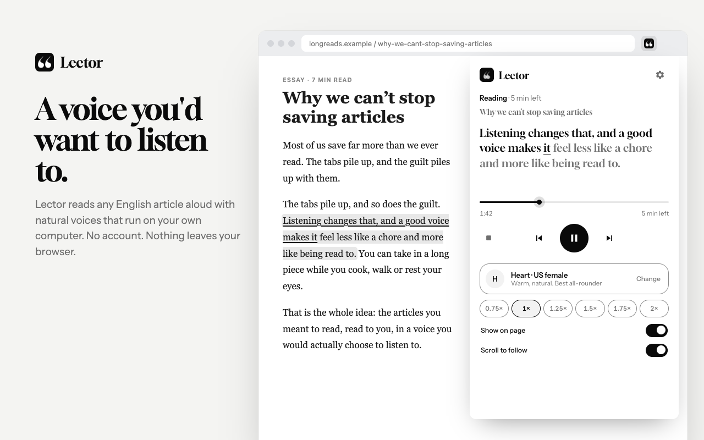

# Lector

**A voice you'd want to listen to.**



Listen to any web page with natural AI voices, entirely on your device.

Install, click, listen. **English only for now** (American and British voices). No account, no server, and nothing you read ever leaves your browser. Lector runs the [Kokoro 82M](https://huggingface.co/hexgrad/Kokoro-82M) speech model locally with WebGPU (or WASM on machines without a GPU).

Inspiration: [Voicebox](https://github.com/jamiepine/voicebox) by Jamie Pine. Lector can later connect to a local Voicebox as an alternative voice engine.

## Features

- **Natural voices.** 28 American and British English voices with instant previews and favourites.
- **Follow along, word by word.** The sentence being read is highlighted on the page and the spoken words are underlined as they're read, so you never lose your place. Pause and keep reading yourself any time. Turn it off with **Show on page**.
- **Start anywhere.** Select text → right-click → **Listen from here**, press `Alt+Shift+H`, or Alt+click a paragraph while listening.
- **Full control.** Seek bar with time left, previous/next paragraph, 0.75×–2× speed without pitch change, media keys and your computer's Now Playing controls.
- **Light on your computer.** Uses your graphics chip when it can, multi-threaded CPU otherwise, and frees memory when you stop. Choose **Voice quality** in Settings if you want a smaller download.
- **Accessible.** Works fully with a keyboard and screen readers, supports high-contrast mode and reduced motion, follows your light or dark theme.
- **Private by design.** Uses `activeTab`, so it only touches a page when you ask it to. The only network access is the one-time model download from Hugging Face. See [PRIVACY.md](PRIVACY.md).

## Install

**Chrome Web Store:** Lector has been submitted and is waiting for Google's review. The store link will appear here once it's approved.

**Until then, install the release build:**

1. Download **[lector.zip](https://github.com/harshmathurx/lector/releases/latest/download/lector.zip)** from the [latest release](https://github.com/harshmathurx/lector/releases/latest).
2. Unzip it.
3. Open `chrome://extensions`, turn on **Developer mode** (top right), click **Load unpacked**, and choose the unzipped folder.

Chrome may remind you that a developer-mode extension is installed; that's expected for builds from outside the store. When the store version is live, remove this one and install Lector from the store to get automatic updates.

The first time you listen, the voice model downloads once (about 90–330 MB depending on your computer) and is cached by the browser. After that, Lector works offline.

**From source:**

```bash
git clone https://github.com/harshmathurx/lector.git
cd lector
bun install
bun run build   # then Load unpacked → dist/
```

## Using it

| Do this | To get this |
|---------|-------------|
| Click the toolbar icon → **Listen to this page** | Read the whole article |
| `Alt+Shift+R` | Start, or play/pause, from any tab |
| `Alt+Shift+H` | Listen from your selection, cursor or the focused paragraph |
| `Alt+Shift+.` / `Alt+Shift+,` | Next / previous paragraph |
| Select text → right-click → **Listen from here** | Start from that spot |
| Select text → right-click → **Listen to selection** | Read just the selection |
| `Alt+click` a paragraph while listening | Jump there |
| Media keys / Now Playing | Play/pause, previous/next paragraph, skip 15s |

On a Mac, Alt is the Option key. Shortcuts can be changed at `chrome://extensions/shortcuts`.

**Language support:** English only. Lector reads English pages with 28 American and British voices. Other languages are not supported yet and will not read well.

## How it works

```
Popup ──────────────┐   polls state, sends commands
Content script ─────┤   extracts the article, highlights the spoken sentence
Background worker ──┤   lifecycle, routing, session recovery
Offscreen document ─┘   Kokoro TTS + Web Audio playback
```

Articles are split into sentence-sized segments (`src/shared/chunker.ts`) that stay within Kokoro's 512-token limit. A small lookahead pump generates a few segments ahead of the playhead; each segment's pause is baked in as trailing silence, so pause, seek and skip are all segment-based. Generated audio is cached in IndexedDB. The heavy ONNX/Kokoro code is loaded lazily so a failure surfaces as an error message instead of a silently dead page. See [CLAUDE.md](CLAUDE.md) for the full architecture and design decisions.

## Development

```bash
bun install
bun run build         # build to dist/
bun run watch         # rebuild on change
bun run typecheck     # tsc --noEmit
bun test              # unit tests
bun run package       # build the store/release zip into release/
```

`scripts/e2e.mjs` is a real-browser end-to-end test (loads the built extension in Chromium with the real model) and `scripts/bench.mjs` measures start time, speed and memory; their headers explain the setup. See [CONTRIBUTING.md](CONTRIBUTING.md).

## Credits and licenses

Lector is MIT licensed ([LICENSE](LICENSE)). It builds on [Kokoro](https://huggingface.co/hexgrad/Kokoro-82M) (Apache-2.0), [kokoro-js](https://github.com/hexgrad/kokoro) and [Transformers.js](https://github.com/huggingface/transformers.js) (Apache-2.0), [ONNX Runtime Web](https://github.com/microsoft/onnxruntime) (MIT) and [Mozilla Readability](https://github.com/mozilla/readability) (Apache-2.0). Type is set in [Gloock](https://fonts.google.com/specimen/Gloock) and [Instrument Sans](https://fonts.google.com/specimen/Instrument+Sans) (SIL OFL 1.1, bundled in `static/fonts/`). See [THIRD_PARTY_NOTICES.md](THIRD_PARTY_NOTICES.md).
